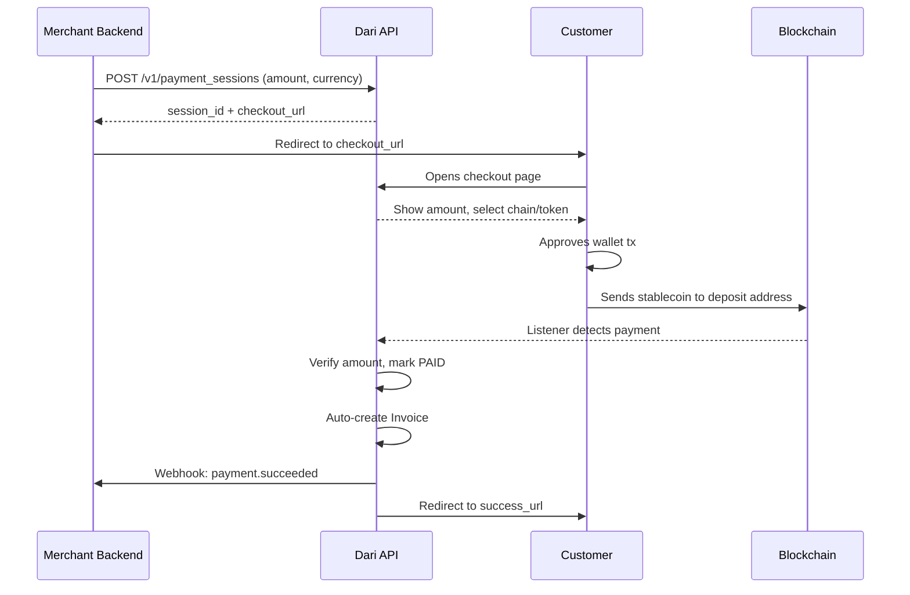
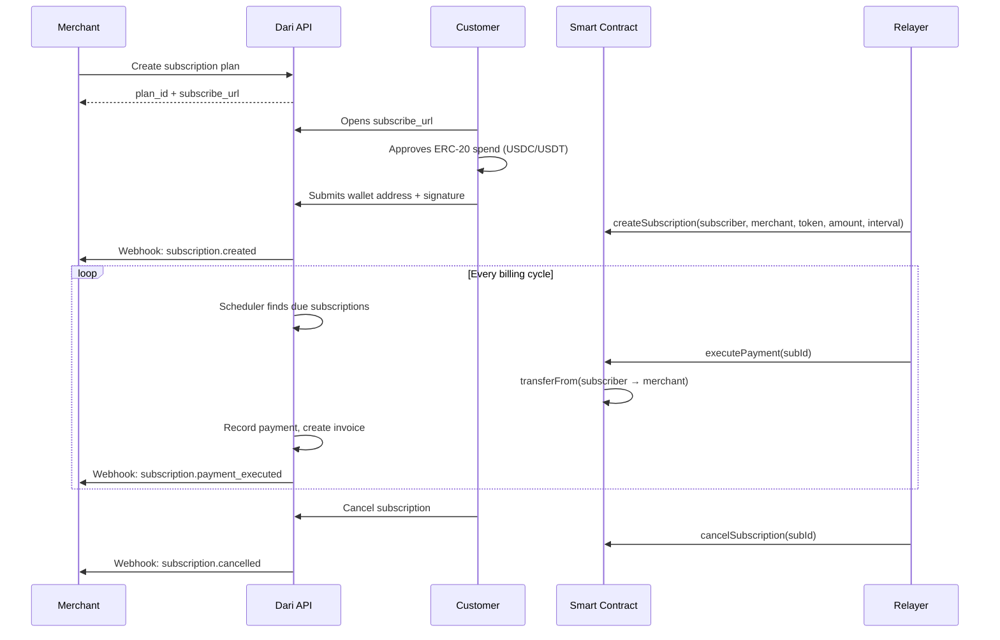
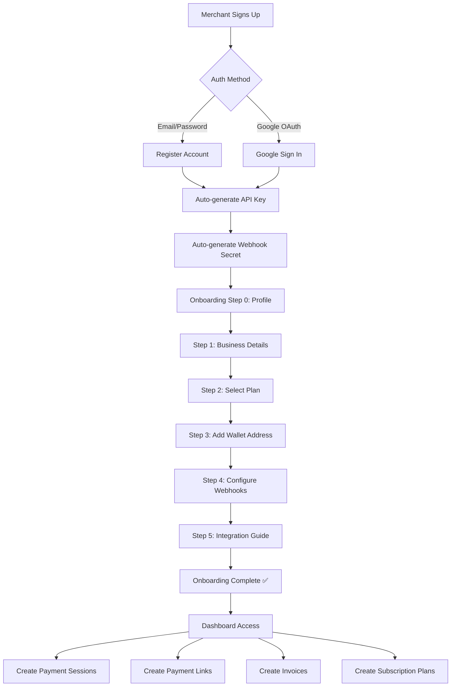
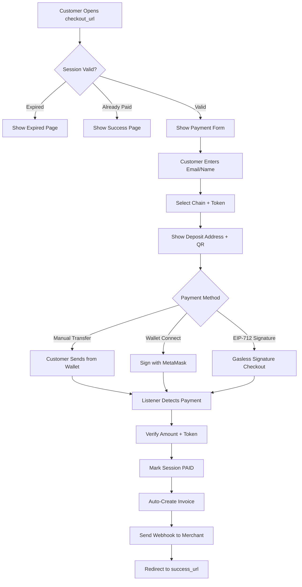
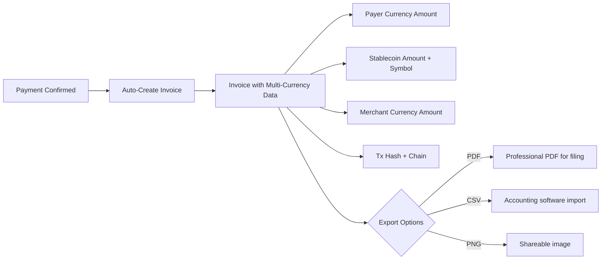
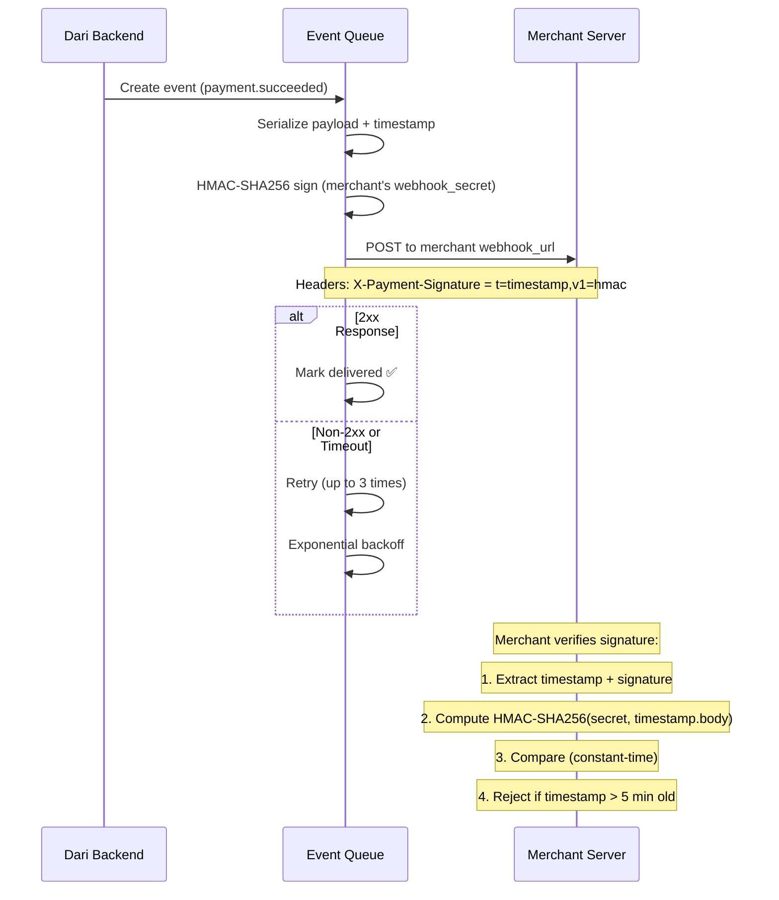
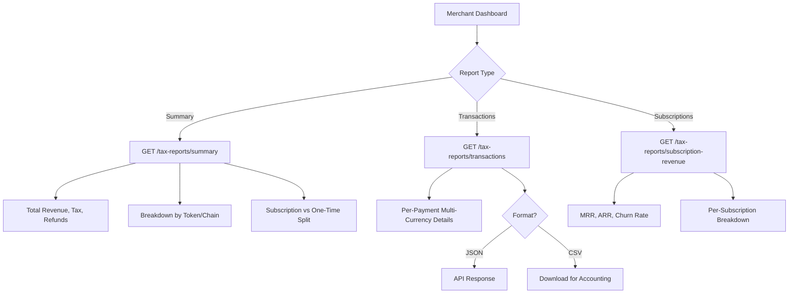
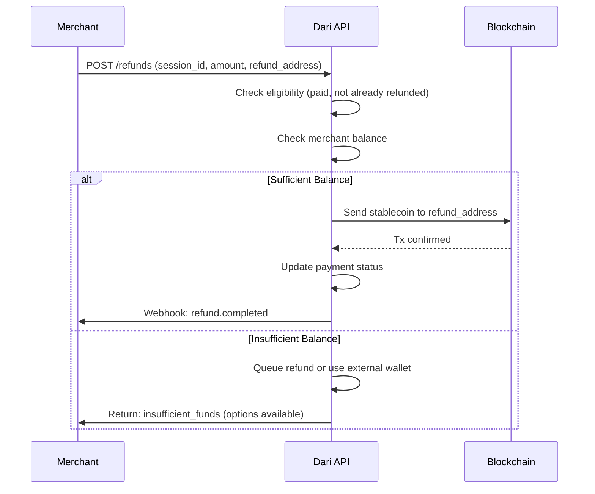
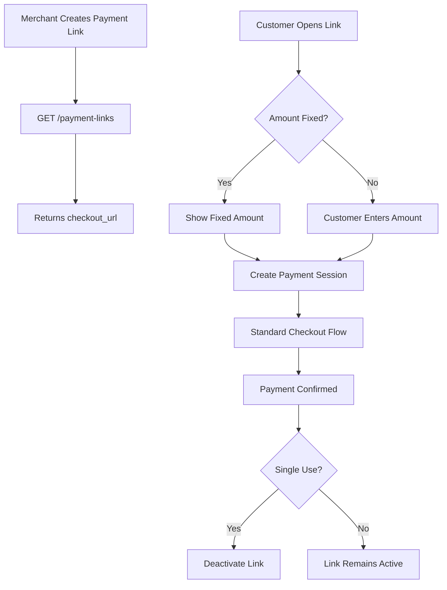

# Dari for Business — Service Flow Diagrams

Visual diagrams of all Dari payment gateway services.

---

## 1. One-Time Payment Flow



---

## 2. Subscription (Recurring) Payment Flow



---

## 3. Merchant Onboarding Flow



---

## 4. Checkout Page Flow



---

## 5. Invoice & Export Flow



---

## 6. Webhook Delivery Flow



---

## 7. Tax Reporting Flow



---

## 8. Refund Flow



---

## 9. Payment Link Flow



---

## 10. Multi-Chain Architecture

```mermaid
flowchart TD
    subgraph API["Dari API Server (FastAPI)"]
        A[Payment Sessions]
        B[Invoices & Export]
        C[Tax Reports]
        D[Subscriptions]
        E[Webhooks]
    end

    subgraph Listeners["Blockchain Listeners (run_listeners.py)"]
        F[Stellar Listener]
        G[EVM Listener]
        H[Tron Listener]
    end

    subgraph EVM["EVM Chains (shared listener)"]
        I[Ethereum]
        J[Polygon]
        K[Base]
        L[BSC]
        M[Arbitrum]
    end

    subgraph Contracts["DariSubscriptions.sol"]
        N[Deployed on all 5 EVM chains]
        O[UUPS Upgradeable Proxy]
    end

    G --> I
    G --> J
    G --> K
    G --> L
    G --> M

    N --> I
    N --> J
    N --> K
    N --> L
    N --> M

    A --> E
    D --> N
